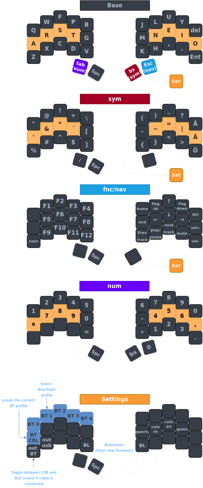

# Brain layout

# Sweep/Urchin layout

# Symbol mnemonic/reminders

# TODO:
- [] Finish layout for brain
- [] Mnemonics in markdown instead of the picture
- [] Caps word [more info](https://getreuer.info/posts/keyboards/caps-word/index.html)
- [] Caps number [more info](https://github.com/zmkfirmware/zmk/pull/1451)
